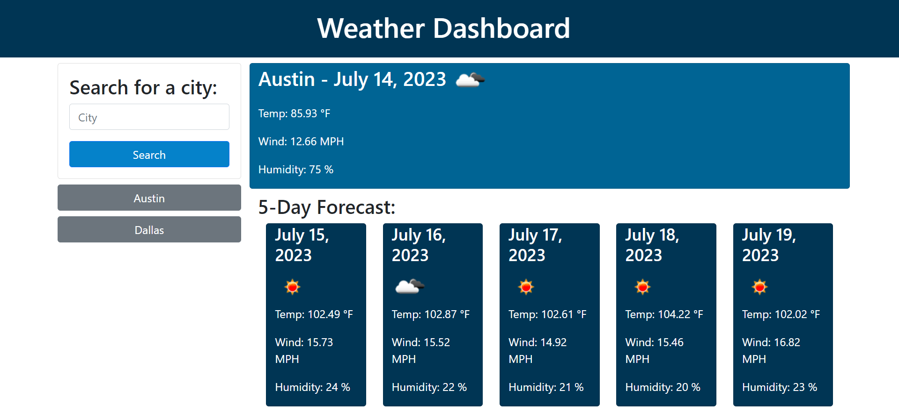

# weather-dashboard

## Description

This is a weather dashboard that allows you to see current weather and the 5-day forecast for which ever city you input. It also saves your history so that you can see the weather of your frequently searched places. 

## Installation

N/A

## Usage

The web application can be viewed [here](https://savannah-shifflet.github.io/weather-dashboard/). Below is a screenshot of the page. 

## Credits

The OpenWeather API was used to retrieve weather forecast data and can be found [here](https://openweathermap.org/api).

## License

Please refer to the LICENSE in the repo.
